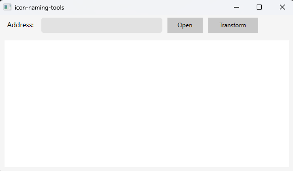
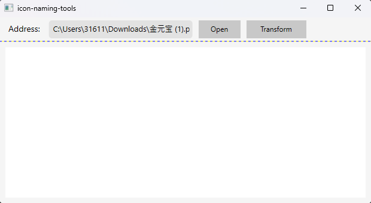
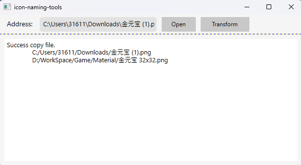
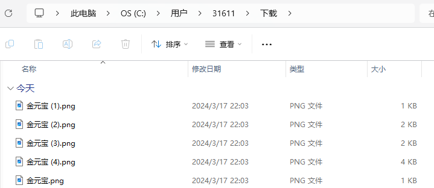
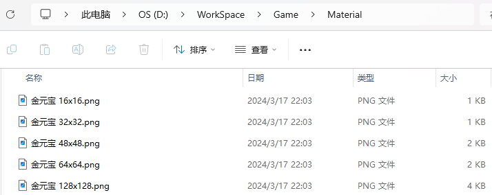

# icon-naming-tools

这是一个文件重命名工具

## Usage

双击打开程序



点击 【Open】, 选择源文件



点击 【Transform】, 更改文件名




## Out

源文件及路径



目标文件及路径



## Attention

+ 这个版本的程序一次只能重命名一个文件

+ 只能替换图像格式的文件

+ 目标路径:

```
D:/WorkSpace/Game/Material/
```

+ 如果目标路径不存在, 不会自动创建目标路径

+ 如果目标文件已经存在, 会覆盖 !!!